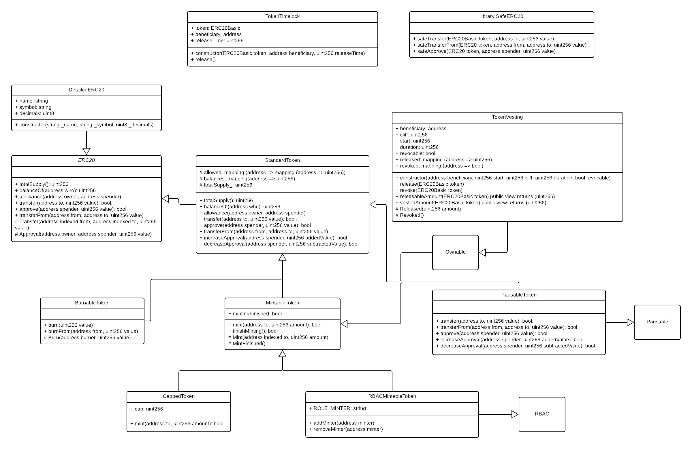

# society_dapp

Examples of different models of ERC-20 token issuance and token vesting based on "points" that work like equity shares.

## Setup

Install dependencies via npm.

```
npm install
```

## Scripts

There's a set of npm scripts to help you use different tools.

```
yarn run start              # build and serve frontend application
yarn run build              # build truffle project
yarn run production         # serve frontend application as prodcution
```

## Tokens

Class diagram based on contracts you can find in the [openzeppelin-solidity/contracts/token/](https://github.com/OpenZeppelin/openzeppelin-solidity/tree/master/contracts/token). I hope the diagram makes it easier for you to understand relationships between different contracts and interfaces.


